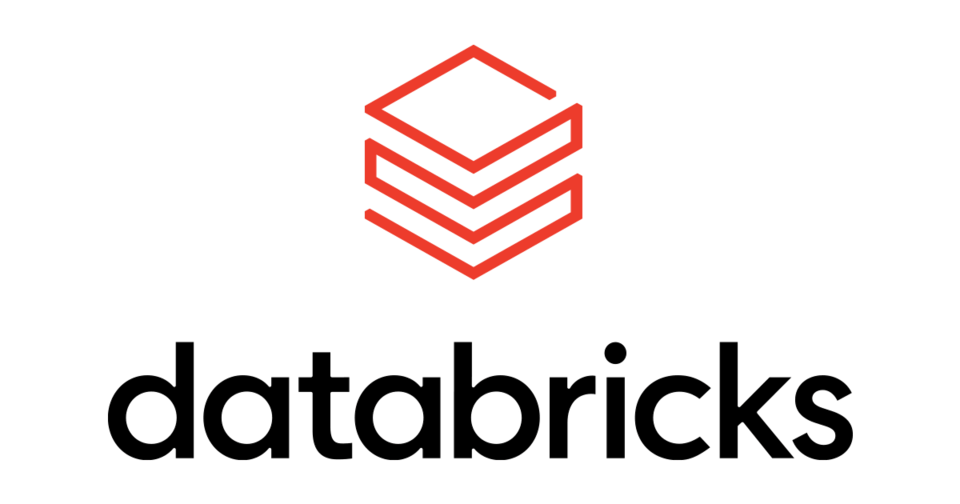

# 👋 Hi, I'm Nahil Ahmed

**Data Engineer | SQL & Spark Enthusiast | Azure Native**

I design and build scalable data systems that deliver reliable, high-quality insights. From batch pipelines to real-time analytics, I focus on performance, clarity, and business impact.

---

### 🛠 Tech Focus

- **Languages:** Python, SQL  
- **Processing:** PySpark, Spark, Delta Lake  
- **Cloud & Tools:** Azure (Databricks, ADF, ADLS), Kafka, Flink, Airflow  
- **Warehousing:** Snowflake, Azure SQL  
- **Dev:** Git, Azure DevOps, VS Code  
- **Analytics:** Power BI, CTEs, Window Functions, Recursive SQL

  
  
  
  
  

---

### 📫 Connect

[LinkedIn](https://www.linkedin.com/in/nahil-ahmed/)  
[Email](mailto:nahil757@gmail.com)

---

I love solving data problems that matter — one clean pipeline at a time.

<!--
**nahilahmed/nahilahmed** is a ✨ _special_ ✨ repository because its `README.md` (this file) appears on your GitHub profile.

Here are some ideas to get you started:

- 🔭 I’m currently working on ...
- 🌱 I’m currently learning ...
- 👯 I’m looking to collaborate on ...
- 🤔 I’m looking for help with ...
- 💬 Ask me about ...
- 📫 How to reach me: ...
- 😄 Pronouns: ...
- ⚡ Fun fact: ...
-->
