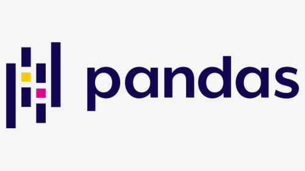

### Hi there 👋

#### I'm Nahil Ahmed! 

👨‍💻 I’m currently working as a <b>Data Engineer/Scientist</b> at <b>Tata Consultancy Services</b>.\
🔭 I’m currently working on Data Science, DevOps, Python\
🌱 I’m currently learning more about data\

**Languages and Tools:**  

<code></code>
<code></code>
<code></code>
<code></code>
<code></code>

<!--
**nahilahmed/nahilahmed** is a ✨ _special_ ✨ repository because its `README.md` (this file) appears on your GitHub profile.

Here are some ideas to get you started:

- 🔭 I’m currently working on ...
- 🌱 I’m currently learning ...
- 👯 I’m looking to collaborate on ...
- 🤔 I’m looking for help with ...
- 💬 Ask me about ...
- 📫 How to reach me: ...
- 😄 Pronouns: ...
- ⚡ Fun fact: ...
-->
